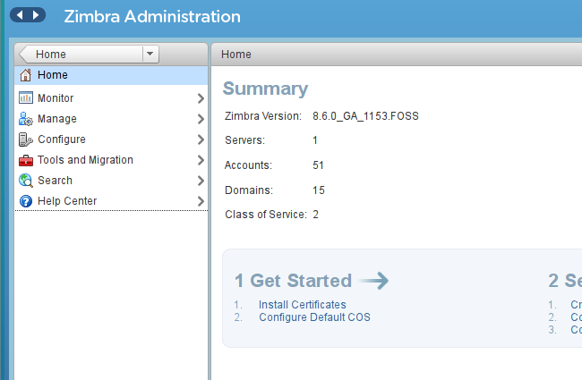
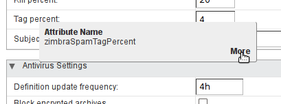
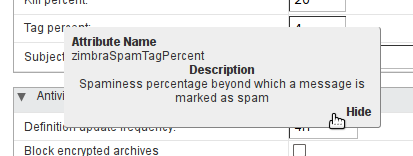
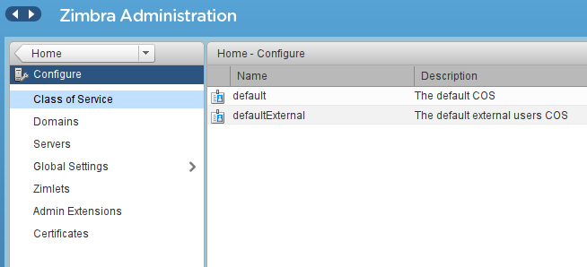
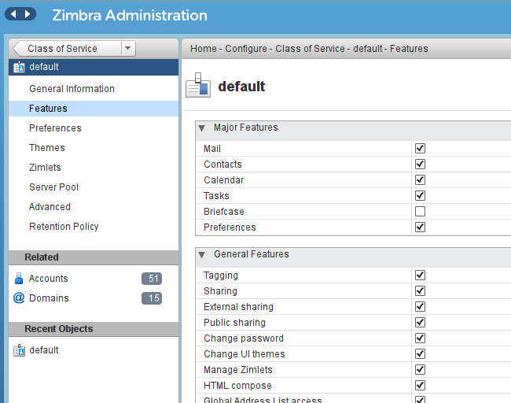
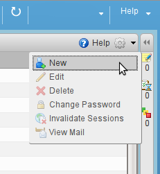
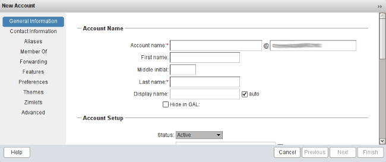
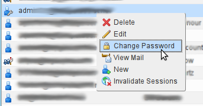
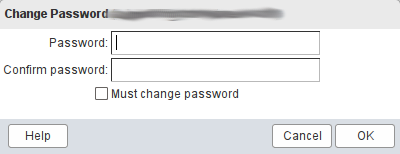

---
author:
    name: Linode Community
    email: docs@linode.com
description: 'Install Zimbra OSE 8.6 on Ubuntu 14.04 LTS Linode'
keywords: ["zimbra", "install zimbra", "mail server", "zimbra email", "zimbra email server", "mail zimbra", "open source guide", "zimbra open source", "postfix", "web mail", "opendkim", "amavis", "ubuntu tahr", "ubuntu 14.04", "ubuntu"]
license: '[CC BY-ND 4.0](https://creativecommons.org/licenses/by-nd/4.0)'
published: 2015-10-01
modified: 2015-10-01
modified_by:
    name: Linode
title: 'Install Zimbra Open Source Edition on Ubuntu 14.04'
contributor:
    name: Bill Bardon
external_resources:
 - '[Zimbra OSE Documentation](https://www.zimbra.com/documentation/zimbra-collaboration-open-source)'
---

[Zimbra](https://www.zimbra.com/) is a complete mail server that provides a configured Postfix with OpenDKIM, Amavis, ClamAV, and Nginx, ready to handle mail for one or more domains. Zimbra on a Linode is one of the quickest paths to an up-and-running mail server that you will find. This guide will take you through the Zimbra installation procedure.




The steps required in this guide require root privileges. Be sure to run the steps below as **root** or with the `sudo` prefix. For more information on privileges see our [Users and Groups](/docs/tools-reference/linux-users-and-groups/) guide.


## Set up Your Linode

1.  Create a Linode with a minimum of 4 GB of RAM. See [Getting Started](/docs/getting-started/) for help setting up your host.

2.  Deploy an Ubuntu 14.04 LTS image to your Linode. Consider using slightly less than half the available disk space for the first image, keeping the other half for taking a backup image before updates. Your partition size will depend on the number of accounts and volume of mail you expect to handle. Once deployed, boot your new host. SSH into the terminal using the command shown on your Remote Access page in Linode Manager and the password you entered when you created the Linode.

3.  You must [set the hostname](/docs/getting-started/#setting-the-hostname) and fully qualified domain name (FQDN), and [update /etc/hosts](/docs/networking/dns/using-your-systems-hosts-file/) prior to installing Zimbra.

4.  Configure your DNS entries at your DNS provider to provide an A record for the host, and point the domain MX record to your new server. A reverse DNS pointer is highly recommended to prevent mail from your server being rejected. See [Running a Mail Server: DNS Records](/docs/email/running-a-mail-server/#dns-records) for details on setting up DNS.

## Download Zimbra

1.  Download the latest release of [Zimbra Open Source Edition](https://www.zimbra.com/downloads/zimbra-collaboration-open-source). It's a good idea to read the release notes and understand the requirements and caveats before installing. Choose the Ubuntu 14.04 LTS 64-bit release and download it to your Linode with `wget`. To do this, right-click the _64bit x86_ link in your browser and copy the link from the Zimbra page. Paste it into your shell command and execute it.

    For example:

        wget https://files.zimbra.com/downloads/8.6.0_GA/zcs-8.6.0_GA_1153.UBUNTU14_64.20141215151116.tgz

     
This Guide is about setting up a new Zimbra Linode, but if you are upgrading an existing Zimbra installation, it is very important that you read the release notes that Zimbra provides! The notes are found on the Download page where you found the software. There may be steps that are required to be performed before or after you upgrade.


2.  Download the SHA256 checksum in the same way you just downloaded the Zimbra tarball.

3.  Test the checksum.

        sha256sum -c zcs-8.6.0_GA_1153.UBUNTU14_64.20141215151116.tgz.sha256

    If the checksum matches, this command will output 'OK'. If not, you probably have a corrupt download. Download them again and re-check.

4.  Extract the Zimbra application files to your Linode root user directory.

        tar xzf zcs-*.tgz

## Install Zimbra

1.  Change to the extracted directory and run the installation script.

        cd zcs-*

        ./install.sh

    After checking some prerequisites, you will be asked to accept the license agreement. Note that while Zimbra OSE is open source, it is not GPL. The link the script displays allows you to read the terms. If you decide not to install, leave the default reply as **N** and press **Enter**. Otherwise type **Y** and press **Enter** to continue. (At any time while running the install script, to accept the default answer shown in brackets, you may simply press **Enter**.)

        ...

        License Terms for the Zimbra Collaboration Suite:
        http://www.zimbra.com/license/zimbra-public-eula-2-5.html

        Do you agree with the terms of the software license agreement? [N]

    After answering **Y**, the script checks for installed software and reports any discrepancies.

4.  Satisfy missing dependencies.

    Zimbra will inform you of any missing dependencies with the *MISSING:* field as shown below.

        Checking for prerequisites...
        FOUND: NPTL
        FOUND: netcat-openbsd-1.105-7ubuntu1
        FOUND: sudo-1.8.9p5-1ubuntu1.1
        FOUND: libidn11-1.28-1ubuntu2
        FOUND: libpcre3-1:8.31-2ubuntu2.1
        MISSING: libgmp10
        FOUND: libexpat1-2.1.0-4ubuntu1
        FOUND: libstdc++6-4.8.4-2ubuntu1~14.04
        MISSING: libperl5.18
        MISSING: libaio1
        FOUND: resolvconf-1.69ubuntu1.1
        FOUND: unzip-6.0-9ubuntu1.3

        Checking for suggested prerequisites...
        MISSING: pax does not appear to be installed.
        FOUND: perl-5.18.2
        FOUND: sysstat
        MISSING: sqlite3 does not appear to be installed.

        ###WARNING###

        The suggested version of one or more packages is not installed.
        This could cause problems with the operation of Zimbra.

        Do you wish to continue? [N]

    These dependencies must be installed before going further, so answer **N** to quit the installer and fix the problem. For example, installing the following packages will satisfy the dependencies named in the output above:

        sudo apt-get install libgmp10 libperl5.18 libaio1 pax sqlite3

5.  Choose installation options.

    Once missing packages are installed, start the installer again. Zimbra will continue its installation. Accept all the defaults, with the possible exception of the `zimbra-snmp` package if you have no use for SNMP monitoring.

        Checking for installable packages

        ...

        Install zimbra-snmp [Y] n

        ...

        The system will be modified.  Continue? [N]

    At this point you are ready to allow the install, so answer **Y**. The packages will be installed and most Zimbra settings will be configured to default settings.

6. Configure MX records.

    If you receive an error about a missing MX record as shown below, it means your domain DNS records are not matching what Zimbra expects to find, based on the hostname you configured earlier. Check your `/etc/hostname` file and your [DNS records](/docs/networking/dns/dns-records-an-introduction/#mx) to resolve the problem.

        DNS ERROR resolving MX for linodemail.example.com
        It is suggested that the domain name have an MX record configured in DNS
        Change domain name? [Yes]

    If you are only testing Zimbra and not deploying, continue by answering **N** to skip changing the domain name.

7. Set admin password and DNS.

    Next you are presented with the Main menu. The installer displays the current settings for Zimbra and allows you to change them. Enter the number of the main section you want to change and the sub-menu for that section will be displayed. Enter the number of the item in the section that you want to change, and enter your preferred value.

        Main menu

        1) Common Configuration:
        2) zimbra-ldap:                             Enabled
        3) zimbra-logger:                           Enabled
        4) zimbra-mta:                              Enabled
        5) zimbra-dnscache:                         Enabled
        6) zimbra-store:                            Enabled
            +Create Admin User:                    yes
            +Admin user to create:                 admin@linodemail.computassist.net
        ******* +Admin Password                        UNSET

           ...

        Address unconfigured (**) items  (? - help)

    By default, no administrative password is set. To set a password, enter **6** to display the `zimbra-store` menu, then **4** to type a new password at the prompt. Enter **r** to return to the main menu. For DNS, enter the `zimbra-dnscache` menu, then change the `Master DNS` IP addresses and return to the main menu.

    
It is common to run mail servers on UTC, as they regularly accept mail from all over the world. This helps when tracing mail flow, when Daylight Saving kicks in or out, and just makes reading logs easier. You may choose to use local time if you prefer.


8.  Finalize the installation.

    Enter **a** to apply your changes to the settings. Finally, enter **Y** to continue the install.

        *** CONFIGURATION COMPLETE - press 'a' to apply
        Select from menu, or press 'a' to apply config (? - help) a
        Save configuration data to a file? [Yes]
        Save config in file: [/opt/zimbra/config.13935]
        Saving config in /opt/zimbra/config.13935...done.
        The system will be modified - continue? [No] y

    The installer will begin the final steps to complete the Zimbra install and inform you of its progress at each step. You will be asked if you wish to share notification of your new installation with the folks at the Zimbra home office.

        You have the option of notifying Zimbra of your installation.
        This helps us to track the uptake of the Zimbra Collaboration Server.
        The only information that will be transmitted is:
            The VERSION of zcs installed (8.6.0_GA_1153_UBUNTU14_64)
            The ADMIN EMAIL ADDRESS created (admin@linodemail.example.com)

        Notify Zimbra of your installation? [Yes]
        Notifying Zimbra of installation via http://www.zimbra.com/cgi-bin/notify.cgi?VER=8.6.0_GA_1153_UBUNTU14_64&MAIL=admin@linodemail.example.com

    When the installation is finished, you'll see the output:

        Configuration complete - press return to exit

9.  Access Your mail server.

    Visit your Linode's hostname or IP address in your browser using https. For example, `https://mail.example.com`. This will open the login page. Log in using the admin account and password created during the install.

    
Since you haven't installed a trusted cert yet, you will likely get a browser warning about an untrusted site. Bypass the warning for now. Later you can either add Zimbra's self-signed cert to your browser or install a trusted cert in Zimbra.


    

    If you configured the appropriate DNS records (step 4 of [Set up Your Linode](#set-up-your-linode) above), you should be able to send and receive mail with this account.

## Configuring Your Zimbra Server

Zimbra provides two ways to manage configuration: a web console and the command line. The command line interface is beyond the scope of this guide but you can find it documented in Appendix A of the Administrator's Guide which is linked to from the Help Center in your admin console.

From the admin console you can configure default settings for new accounts (Zimbra calls this a Class Of Service, or COS), add and manage accounts, change passwords, and generally manage your mail server. The admin console has built-in descriptions for most settings. Click the label for the input item and a tool tip will appear. Click the **More** button below right and a more detailed note will be shown.

 


You can also reach the admin console if you are already logged in to your Zimbra webmail page. A drop-down menu beside your account name in the upper right of the window provides a link to the admin console.


### Global Settings

Your server was configured when you installed, and most of those settings will work as is. You may want to visit a few in particular to control who it is willing to talk to and eliminate some types of spam.

1.  From the admin console **Home** menu, click **Configure** and then **Global Settings**. There is a page menu on the left. Feel free to browse, there are hundreds of options here.

2.  Click the **MTA** page to configure some Postfix settings that can control from whom you will accept mail. If you have known servers on other networks outside your own from which you want to accept mail, you can add them to the **MTA Trusted Networks**. Enter them as IP addresses with subnets, separated by a space, e.g. "127.0.0.0/8 10.0.0.0/16 12.34.56.78/32".

3.  Control your maximum message size in the **Messages** section. Enter your limit in KB, so 25 MB would be 25600 KB.

4.  The **Protocol checks** can stop many spam messages before they enter your system. You may turn them all on, but at least _Sender address must be fully qualified_ should be checked.

5.  **DNS checks** use realtime blacklists to reject mail coming from known spamming servers. `zen.spamhuas.org` is a good suggestion to start with. Enter the domain name into the **List of Client RBLs**.

6.  Click the **AS/AV** page. Here you determine how "spammy" a message has to be to get tagged or rejected. Zimbra uses SpamAssassin to score every message. A score of zero or less than zero means the message is likely to be worth delivering. A score above zero means there are some indicators that this could be an unwanted email. The **Kill percent** is the score above which Zimbra will not deliver the message at all. The **Tag percent** is the score above which Zimbra will let the message through, but deliver it to the Junk folder.

    These percentages will vary depending on your incoming mail stream. You have to balance controlling spam with getting false positives on good mail. Also, these numbers apply globally to all your accounts. Experimentation will show you which way to move. Zimbra starts at Kill = 75, Tag = 33. You will probably experience quite a bit of spam still coming through at those values. After much testing and over a year of gradually walking them down, I arrived at Kill = 20, Tag = 4. Please test under your own conditions and learn your own optimal values!

7.  Click the **Save** button and then the **Home** button at the top left.

8.  If you made changes to Global Settings, restart your server before continuing.

### Classes of Service

Zimbra installs a default class of service which will be applied to all new accounts. If you don't need to give different capabilities or settings to different groups of users, this default class will be all you need. You can create additional classes and then assign them to users as required to control their privileges, access to features, quotas, and default settings.

1.  To manage COS in the console, click the **Configure** menu option. The Configure menu opens, and **Class of Service** is already selected.

    

2.  Double-click the **default** COS and the Class of Service page opens. There is a page menu on the left. Each page allows you to modify the settings of this COS.

    

3.  You will want to go through the **Features** page and decide what you want to offer your users. You may wish to turn off the Briefcase (file saving and sharing) if you don't have enough storage, restrict some forms of sharing, or enable external POP or IMAP access, for example.

4.  Next, read through **Preferences**, setting each item the way you want it for your users. Remember, all of these settings apply to this class of service only, and you can create other classes if needed.

5.  Finally, view the **Advanced** page. It's recommended to set an **Account quota**, even if it's fairly large, to prevent one user from consuming all the disk space. You can customize your **Quota warning message template** here. Scroll down to set password requirements, lockout options, and trash and spam retention policies.

6.  If needed, you can proceed to add more classes of service and define all these settings for another type of user. Different classes could have different quotas, access to more or fewer features, or perhaps one group gets external IMAP or access to the Briefcase tab. Note that individual user account settings can override the COS settings. New user accounts will be assigned the default COS unless you have defined another and choose it when creating the account.

### User Accounts

You received an admin account when you installed Zimbra. The Open Source Edition has no limit on the number of accounts you can have. It is only limited by your server's ability to handle the traffic. If you have been through the **Classes of Service**, creating another account will be a trip through familiar territory, as most of the settings are the same, but applicable to this individual account.

#### Creating Accounts

1.  from the **Home** page click **Manage**. The **Accounts** page will be displayed.

2.  Click the gear icon top right, then click **New**.

    

    

3.  The only required items are the email address and the last name but you will want to create a temporary password, and possibly override the default COS if you've set up others.

4.  If you want to explicitly set other properties on this account, click **Next** to proceed through the pages. At any time, you can choose **Finish** to accept the defaults for the rest of the properties.

5.  Once you have created the account, it is immediately ready to use.

#### Managing Accounts

When users forget their passwords, resets are easily accomplished.

1.  On the **Manage Accounts** page, right-click the account you want to change, and click **Change Password**.

    

2.  Enter a temporary password which you will send to the user, and also click **Must change password**. The next time they log in, they will be prompted to choose a new password.

    

## Install an SSL Certificate

Zimbra creates and uses a self-signed SSL security certificate upon installation. If you are planning to offer your email service to others, you will want to install a trusted certificate from a third-party Certificate Authority (CA).

### Create a Certificate Signing Request (CSR)

1.  Log in to the Zimbra admin console

2.  Click the **Configure** menu, then **Certificates**.

3.  Click the **gear icon** in the toolbar and select **Install Certificate**.

4.  The Zimbra Certificate Installation Wizard will open. Choose your primary domain and click **Next**.

5.  Select the option to generate the Certificate Signing Request (CSR) and click **Next**.

6.  For details on how to properly fill the form, you should visit your CA's website and follow their recommendations. Generally, you will enter your FQDN as the common name, the appropriate country, state/province, city and your own organization name. Leave the Alternative name blank if your cert will only be used for the primary domain, or enter the other forms of your domain (different hosts, subdomains) if you will be getting a wildcard or multi-domain cert. For purposes of email, your cert only needs to authenticate your server's FQDN.

7.  Copy the CSR text and finish the Zimbra wizard, return to your CA's website and follow their process to purchase your SSL certificate.

### Install Your Certificate into Zimbra.

1.  In the Zimbra admin console, click the **Configure** menu, then **Certificates**.

2.  Click the **gear icon** in the toolbar and select **Install Certificate**.

3.  The Zimbra Certificate Installation Wizard will open. Choose your primary domain and click **Next**.

4.  Select the option to install the commercially signed certificate and click **Next**.

5.  Review the information in your CSR one more time, then click Next.

6.  Upload the files received from your CA. Various CAs deliver the certificate, the intermediate CA and root CA files in different ways. You may receive a ZIP file containing everything you need, or you may need to download the root and intermediate CA files from their web site. Again, consult your CA's web site for the correct handling of these files. Once you have all the needed files, upload each using the Browse button in the Certificate Installation Wizard. Then click **Next**.

7.  The wizard will install the new cert. Once finished, you can confirm the install in two ways. In the admin console, go to **Configure**, **Certificates**, and double-click your server name. The certificate information will be displayed. Or, visit your server's Zimbra webmail page and display the cert info in your browser.
